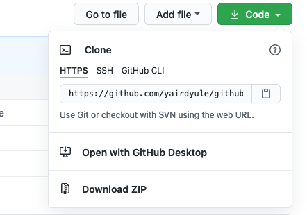

# An (oversimplified, unqualified) introduction to Github!

Hooray!! Exciting times in 2275—we've finished the most recent midterm, and are turning our gazes to the Next Big Thing!  

As I'm sure we're all aware, this consists of a fun project, the shape of which is determined individually (or, in groups, I suppose). This means no (true) writeup full of explicit instructions; rather, some free-form goodness! With such great freedom comes the need for great... accountability? Sure.

# Motivation
**Let's not kid ourselves**. We've all submitted something along the lines of Final_Paper_aaaa111.pdf in our educational careers. We should take this as an opportunity to reflect: this naming scheme, though convenient, reflects very little about the state of our ostensibly final draft! Is this version *actually* the final? If not, what did we change between the creation of *this* draft, and the subsequent iterations? The answers to these questions are lost to the ether, hopelessly lost. While this may not be terribly consequential for paper drafting, coding is an entirely different beast, since the changes you make in your code can have dire consequences.

We've all certainly found ourselves dazed and confused, trembling at the mercy of an unexpected, yet rather heinous segfault—doubtless, the product of haphazardly pulling and twisting some levers and knobs in our code—and realized that nothing short of a few minutes of careful ctrl+z'ing could restore our code to its former ~~glory~~ functionality. Surely that is a possible route for us to take, but *what if there was a better way?*

# Enter: Github!!

We've decided to require the use of Github in your projects for several reasons—some logistical, some not—all good for you! Github (and/or, Git, an introduction to which is outside of the scope of this class—suffice it to say, Github is a pretty, easily digestable wrapper for Git functionality) is standard in all walks in which Average Cathy the CSCI'ist will find themselves employed. This fact arises from a nigh-universal need for **Version Control**!! 

# Version control
As defined in Chapter 1.1 of the ['Git textbook'](https://git-scm.com/book/en/v2), source control is a system that records changes to a file or set of files over time so that you can recall specific versions later. This becomes especially useful when our programming is taken out of the realm of submitting a cpp file on canvas, and instead to 'hey let's simultaneously work on (see: *make changes to*) the same project!', or 'wow, I sure want my TA to be able to see that someone has made changes to my code!'. Nowadays, we're in the latter realm. Luckily, this requires very little in the way of adaptations on your end, and what *is* required, we'll be going over. Plus, it's super cool, truly valuable knowledge.

It will help too get a term out of the way, so that we can proceed to.. well, getting a few more terms out of the way. 
* __Repository__ (affectionately: Repo): A place for all of your project's code to go. 

Go ahead and navigate on over to 'tutorial.md'

# Review
```git clone [cloneurl]``` - This will allow you to clone the repo that you would like to access and work with.

<p align="center">
  
</p>

```git add [filename]``` - This will allow you to add the file to your next commit.

```git commit -m [message]``` - This will allow you to commit your new changes.
Note: The [message] portion in your commit command is pretty useful. You can add descriptions of exactly what changes were made. This makes it easier to look back on commits and figure out what each commit did (i.e. what broke when)

```git push origin main``` - This will push your commits to the main branch. You *can* use the abbreviated ```git push``` if you aren't branched (a topic we won't cover in depth here).

Note: If you know there have been changed made to the repo since you last worked on it, make sure to do the following command to update your cloned repo.

git pull
