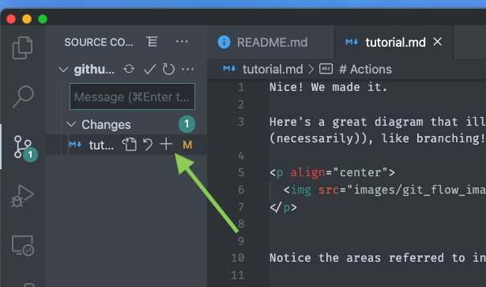
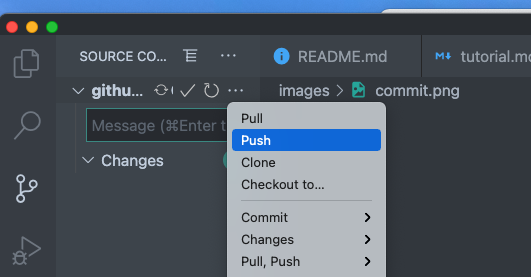

Nice! We made it. 

Here's a great diagram that illustrates the concepts we will need for our purposes (and even some we won't ((necessarily)), like branching!)

<p align="center">
  
</p>


Notice the areas referred to in the blobs.

# Terminology
* __Working directory__: This is the folder (directory) in which you are editing your files, in your text editor (VSCode, Sublime, etc).

* __Staging area__: This is where the files you've decided to track (via ``git add``) in your working directory will reside, until you *commit* them to the...
* __Local repo__: A hidden git directory in your current directory. Don't worry too much about this one, just know that changes that you've committed to the local repo are then *pushed* to the...
* __Remote Repo__: The repository on Github.com/Github desktop!

So, I used a couple of terms which now need defining. So close to done!

# Actions
* __Add__: Stages the changes that you've made in your editor. Invoked via (```git add .```, ```git add filename.ext```, etc) in the terminal, or by the context menu in VSCode.


<p align="center">
  
</p>

* __Commit__: Commits your added changes to your local repo. Invoked with (```git commit -m "Description of changes```) in the terminal, or by the context menu in VSCode.

<p align="center">
  
</p>

* __Push__: Pushes the local repo's commits to the remote repository, found on Github.com. Invoked with (```git push```), or, once again, by the context menu in VSCode.


<p align="center">
  
</p>


* __Pull__: Updates your working directory/local repo with any changes that have been made on the remote repository. Invoked with (```git pull```), or... well, you get it.
